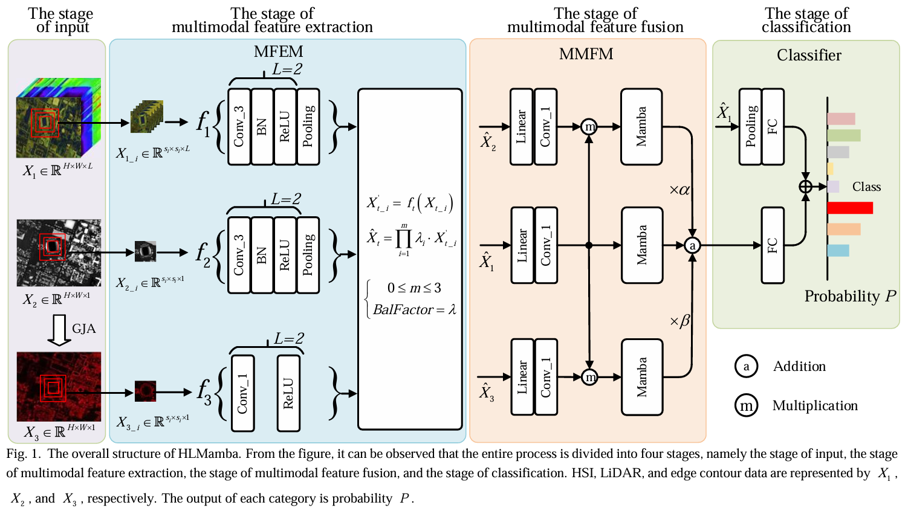

# HLMamba
This an official Pytorch implementation of our paper ["Joint Classification of Hyperspectral and LiDAR Data Based on Mamba"](https://ieeexplore.ieee.org/document/10679212). The specific details of the framework are as follows.

****
# Datasets
- [The Houston2013 dataset](https://hyperspectral.ee.uh.edu/?page_id=459)
includes a hyperspectral image (HSI) and a LiDAR-based digital surface model (DSM), collected by the National Center for Airborne Laser Mapping (NCALM) using the ITRES CASI-1500 sensor over the University of Houston campus in June 2012. The HSI comprise 144 spectral bands covering a wavelength range from 0.38 to 1.05 $\mu m$ while LiDAR data are provided for a single band. Both the HSI and LiDAR data share dimensions of 349 × 1905 pixels with a spatial resolution of 2.5 $m$. The dataset contains 15 categories, with a total of 15,029 real samples available.
- [The MUUFL dataset](https://github.com/GatorSense/MUUFLGulfport)
was acquired in November 2010 over the area of the campus of University of Southern Mississippi Gulf Park, Long Beach Mississippi, USA. The HSI data was gathered using the ITRES Research Limited (ITRES) Compact Airborne Spectral Imager (CASI-1500) sensor, initially comprising 72 bands. Due to excessive noise, the first and last eight spectral bands were removed, resulting in a total of 64 available spectral channels ranging from 0.38 to 1.05 $\mu m$. LiDAR data was captured by an ALTM sensor, containing two rasters with a wavelength of 1.06 $\mu m$. The dataset consists of 53,687 groundtruth pixels, encompassing 11 different land-cover classes.
- [The Trento dataset](https://drive.google.com/drive/folders/1HK3eL3loI4Wd-RFr1psLLmVLTVDLctGd )
This dataset was collected in a rural area of Trento in southern Italy and includes both HSI and LiDAR datasets. The spatial size is 166 × 600 pixels, with a spatial resolution of 1 m. The HSI data spans a wavelength range of 0.42 ~ 0.99 $\mu m$, containing 63 spectral bands. Additionally, the LiDAR data was obtained using a 3100EA sensor. This dataset contains 30,214 labeled samples across 6 types of land cover categories.
****
# Dataset download
Baidu Cloud link for Houston dataset: https://pan.baidu.com/s/13oovgQKaNQuoGrzKs1tP-g    pw：x7ah
Baidu Cloud link for MUUFL dataset: https://pan.baidu.com/s/1rOx1g2Cju3Cvp4-vWwQRtA    pw：qw60
Baidu Cloud link for Trento dataset: https://pan.baidu.com/s/1inM-D7YZW803I1cj5W0dgA   pw：bzih

# Train HLMamba
``` 
python demo.py
```
# Results
All the results presented here are referenced from the original paper.
| Dataset | OA (%) | AA (%) | Kappa (%) |
| :----: |:------:|:------:|:---------:|
| Houston2013  | 96.80  | 97.36  |   96.54   |
| MUUFL  | 87.96  | 83.29  |   84.23   |
| Trento  | 99.54  | 98.91  |   99.38   |
****
# Citation
If you find this paper useful, please cite:
```
@ARTICLE{10679212,
  author={Liao, Diling and Wang, Qingsong and Lai, Tao and Huang, Haifeng},
  journal={IEEE Transactions on Geoscience and Remote Sensing}, 
  title={Joint Classification of Hyperspectral and LiDAR Data Based on Mamba}, 
  year={2024},
  volume={62},
  number={},
  pages={1-15},
  doi={10.1109/TGRS.2024.3459709}}
```
****
# Contact
Diling Liao: [liaodling@mail2.sysu.edu.cn][VX:3097264896]
